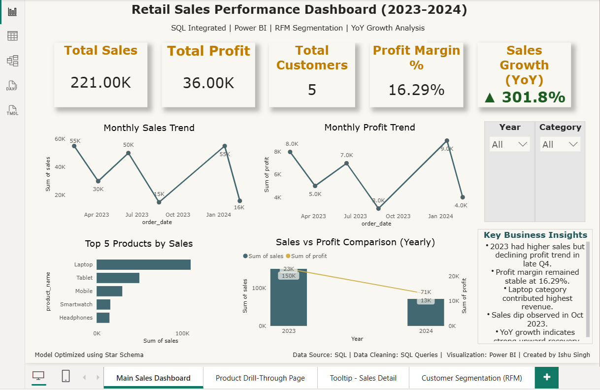
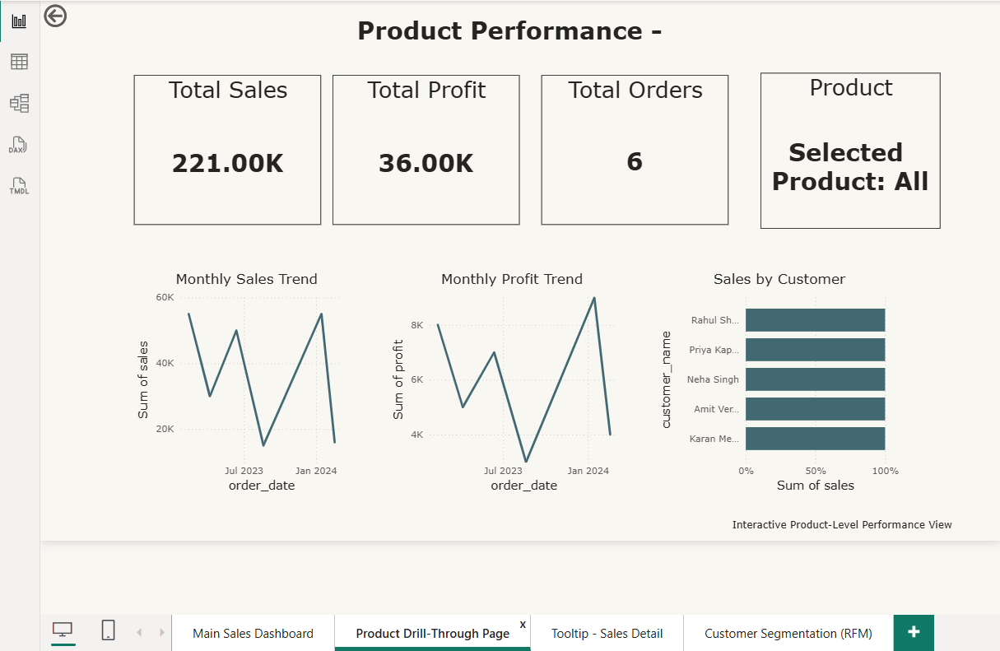
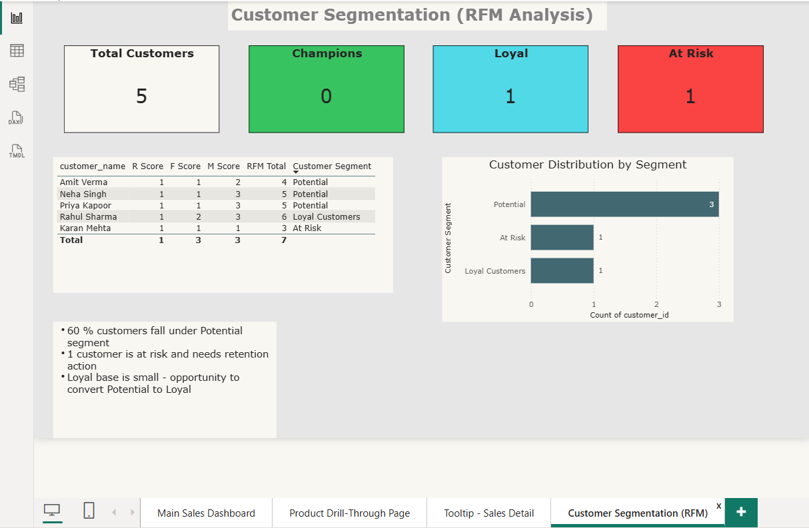

📊 Retail Sales Performance Dashboard (SQL + Power BI)

🔍 Project Overview

This project presents a complete Retail Sales Analysis solution integrating SQL data modeling with Power BI interactive visualization.
The dashboard provides executive-level insights into sales performance, profitability, customer behavior, and RFM-based segmentation.

🛠 Tools & Technologies

MySQL (Data Cleaning & Aggregation)
Power BI (Data Modeling & Visualization)
DAX (Measures & KPIs)
Star Schema Data Model

📈 Key Features

✔ Total Sales, Profit & Customer KPIs
✔ Year-over-Year (YoY) Growth %
✔ Profit Margin Calculation
✔ Monthly Sales & Profit Trend Analysis
✔ Top 5 Products by Revenue
✔ Drill-through Product Detail Page
✔ Custom Tooltip Page
✔ Customer RFM Segmentation Dashboard

📊 RFM Segmentation Logic

Customers are segmented based on:
Recency (Days since last purchase)
Frequency (Total orders)
Monetary (Total revenue contribution)
Segments Created:
Champions
Loyal Customers
Potential Customers
At Risk Customers

📌 Key Business Insights

60% customers fall under Potential segment
Loyal base is limited — opportunity to increase retention
One customer identified as At Risk
Sales growth shows strong upward YoY trend

📁 Project Structure

Main Executive Dashboard
Product Drill-through Page
Tooltip Detail Page
RFM Customer Segmentation Page

💡 Business Value

This dashboard helps business stakeholders:
Track performance trends
Identify high-value customers
Detect churn risk
Optimize revenue strategy

## 📊 Dashboard Preview

### Main Dashboard

---

### Product Drill Through Page

---

### RFM Customer Segmentation

Created by: Ishu Singh
